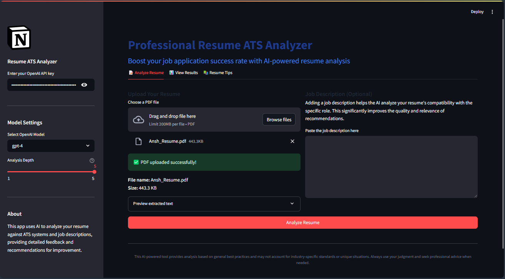
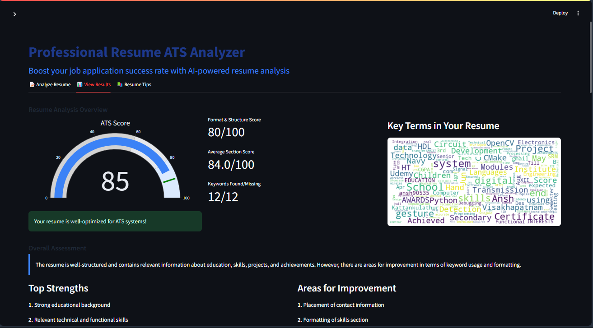
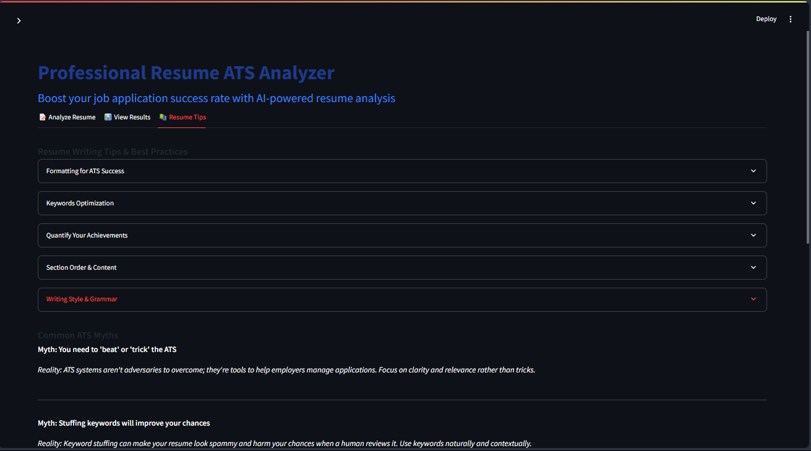

# Professional Resume ATS Analyzer




A powerful Streamlit web app that uses AI (OpenAI GPT models) to analyze your resume for ATS (Applicant Tracking System) compatibility. Upload your resume (PDF), optionally add a job description, and receive a detailed, actionable report with scores, keyword analysis, strengths, improvement areas, and best-practice tips.

## Features

- **PDF Resume Upload**: Extracts and analyzes your resume content.
- **Job Description Matching**: *(Optional)* Paste a job description to tailor the analysis.
- **AI-Powered Analysis**: Uses OpenAI GPT models for comprehensive, section-by-section feedback.
- **ATS Score**: Get an overall compatibility score (0–100).
- **Detailed Feedback**: Assessment and recommendations for each resume section.
- **Keyword Analysis**: Identifies present, missing, and overused keywords.
- **Word Cloud**: Visualizes key terms in your resume.
- **Interactive Visualizations**: Section scores, metrics, and keyword stats.
- **Downloadable Report**: Export a markdown analysis report.
- **Best-Practice Tips**: Built-in guidance for resume writing and ATS optimization.

## Demo





## Setup Instructions

### 1. Clone the repository

```bash
git clone https://github.com/Amishmathur1/ResumeATS
cd ../ResumeATS
```

### 2. Install dependencies

```bash
pip install -r requirements.txt
```

### 3. Download NLTK Resources

The app will attempt to download required NLTK resources (punkt and stopwords) automatically.  
If you encounter issues, run:

```python
import nltk
nltk.download('punkt')
nltk.download('stopwords')
```

### 4. Run the app

```bash
streamlit run main.py
```

## Usage

- Enter your **OpenAI API key** in the sidebar.
- Upload your **resume** as a PDF.
- *(Optional)* Paste a **job description** for targeted analysis.
- Adjust analysis depth and model settings as needed.
- Click **Analyze Resume** to receive your report.
- View detailed results, download your report, and explore resume tips.

## Requirements

See `requirements.txt` for all dependencies.
```
streamlit
openai
PyPDF2
pandas
matplotlib
numpy
plotly
wordcloud
nltk
